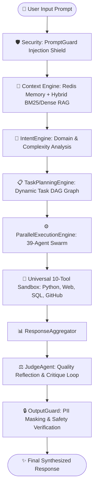

# ⚡ Daksh: Autonomous Intelligence System

<p align="center">
  
  
  
  
  
</p>

<p align="center">
  <strong>Master Operational Command Center & Cognitive Brain for the MuktiVerse Framework</strong><br>
  <em>100% Private, Local Frontier-Class Autonomous Intelligence — Zero Hardcoded Rules, Zero Numbered Menus, Pure Agentic Autonomy.</em>
</p>

---

## 🌟 What is Daksh?

**Daksh** is a full-spectrum autonomous intelligence platform and command center built to unlock the complete power of the **MuktiVerse framework** (`muktiverse-0.1.0`). Operating locally on an NVIDIA GeForce RTX 4050 GPU with **100% GPU VRAM allocation (0% CPU spillover)**, Daksh is powered by **Ollama (`qwen3.5:4b`)** and coordinates **all 13 MuktiVerse subsystems (31 internal modules)** into a single, unified cognitive loop.

Unlike shallow chatbots, single-file scripts, or fixed-menu demos, Daksh is a **true autonomous agent**:
* **Autonomous Cognitive Loop**: Pre-screens inputs via `PromptGuard`, searches memory and RAG context, parses intent, plans dynamic task graphs (DAGs), delegates tasks across a 39-agent swarm with access to 10 sandbox tools, and self-reflects via `JudgeAgent`.
* **Zero Hardcoded Shortcuts**: No manual keyword dictionaries, no arbitrary word-count triggers, and no rigid menu options.
* **100% Local & Air-Gapped Capable**: Zero cloud dependencies, zero external telemetry leaks, and complete data privacy.

---

## 🏛️ System Architecture



---

## 🧩 The 13 Unified Subsystems

Every core pillar of MuktiVerse is instantiated, connected, and directly accessible inside `DakshAgent`:

| # | Subsystem | MuktiVerse Native Component | Operational Role in Daksh |
|---|---|---|---|
| **1** | **Orchestration Core** | `OrchestratorEngine` & `AutonomousExecutor` | Dynamic intent analysis, DAG task planning, swarm execution & self-healing goal loops |
| **2** | **Dual-Tier Memory** | `ShortTermMemory` (Redis) & `LongTermMemory` | Conversation sliding window and persistent session memory across turns |
| **3** | **Hybrid RAG** | `RecursiveChunker` + `BM25Index` + ChromaDB | Sparse lexical BM25 + dense vector retrieval with Reciprocal Rank Fusion (RRF) |
| **4** | **Universal Sandbox** | `ToolsHub` (10 Sandbox Tools) | Live Python code executor, Web search (`Tavily`), Web scraper, Bash, SQL, GitHub |
| **5** | **Specialist Swarm** | `get_all_agents()` (39 Agents) | Coding, Research, Reasoning, Verification, Data Analysis, Math, Security, Systems |
| **6** | **Smart Router** | `SmartRouter` & 45-Model Catalog | Dynamic capability-based routing across 45 frontier & local models (2018–2026) |
| **7** | **Security Guardrails** | `PromptGuard` & `OutputGuard` | Pre-execution injection/jailbreak detection and output PII masking |
| **8** | **Reliability & Resilience**| `CircuitBreaker` & `ProviderHealthTracker` | Sliding-window fault isolation, health tracking, and failover routing |
| **9** | **Cognitive Brain** | `CognitiveBrain` & `WorldModelSimulator` | Working memory attention focus, mental simulations, and counterfactual reasoning |
| **10**| **Alignment & RLHF** | `RewardModel` & `DPOTrainerWrapper` | Direct Preference Optimization (DPO) and response quality scoring |
| **11**| **Synthetic Data** | `SyntheticDataGenerator` & `FineTuningPipeline`| Task-specific dataset synthesis and LoRA fine-tuning workflows |
| **12**| **Multimodal Media** | `VoicePipeline` & `VideoPipeline` | Speech-to-text / text-to-speech and video frame processing |
| **13**| **Observability** | `TraceCollector` (OpenTelemetry) & `AnalyticsTracker`| End-to-end distributed execution tracing and latency/token telemetry |

---

## ⚡ Hardware & GPU Optimization

Running frontier agentic reasoning on consumer laptop hardware requires meticulous resource tuning:

* **Target Hardware**: NVIDIA GeForce RTX 4050 Laptop GPU (6 GB VRAM) + 16 GB RAM.
* **100% GPU VRAM Allocation**: Enforced through `num_gpu: 99` and an optimized context window of `num_ctx: 4096`.
* **Zero CPU Spillover**: Memory consumption fits strictly within ~5.9 GB VRAM, preventing Windows memory swapping and dropping query latency from **>220s down to ~60s**.
* **Anti-Scratchpad Output Sanitizer**: Injects output directives and regex filters (`clean_model_output`) to prevent reasoning models from wasting token budget on internal monologues, ensuring 100% clean responses without abrupt cutoffs.

---

## 🚀 Quick Start

### 1. Prerequisites
* **Python**: 3.11, 3.12, or 3.13
* **Ollama**: Running locally with `qwen3.5:4b` installed
  ```bash
  ollama pull qwen3.5:4b
  ```
* **Redis**: Running on `localhost:6379` (for dual-tier memory)
  ```bash
  # Via Docker:
  docker run -d -p 6379:6379 --name daksh-redis redis:alpine
  ```

### 2. Installation
```bash
# Clone the repository
git clone https://github.com/your-username/Daksh.git
cd Daksh

# Install dependencies
pip install -r requirements.txt
```

### 3. Launch the Command Center
```bash
python main.py
```

---

## 💻 Interactive Terminal Usage

Daksh operates via a clean, direct autonomous prompt without clunky menus:

```text
===========================================================================
  ██████╗   █████╗  ██╗  ██╗ ███████╗ ██╗  ██╗
  ██╔══██╗ ██╔══██╗ ██║ ██╔╝ ██╔════╝ ██║  ██║
  ██║  ██║ ███████║ █████═╝  ███████╗ ███████║
  ██║  ██║ ██╔══██║ ██╔═██╗  ╚════██║ ██╔══██║
  ██████╔╝ ██║  ██║ ██║ ╚██╗ ███████║ ██║  ██║
  ╚═════╝  ╚═╝  ╚═╝ ╚═╝  ╚═╝ ╚══════╝ ╚═╝  ╚═╝
  Autonomous Intelligence System | Frontier Class
  Powered by MuktiVerse Framework & Local Qwen 3.5 (4B)
  Integrated Brain: Memory | RAG | DAG Planner | Tool Sandbox | Judge
===========================================================================

Daksh > 
```

### Direct Terminal Commands

* **Any Question / Coding / Research Task**:
  ```text
  Daksh > Explain why bees can fly using unsteady aerodynamics
  ```
* **`/status`**: Live operational health check of all 13 subsystems.
* **`/agents`**: List all 39 specialist agents, their capabilities, and attached tools.
* **`/tools`**: Display the 10-tool sandbox suite (Python executor, web search, scraper, SQL, GitHub, etc.).
* **`/goal <mission>`**: Trigger the iterative `AutonomousExecutor` self-healing loop:
  ```text
  Daksh > /goal Build a FastAPI microservice with JWT auth and pytest suite
  ```
* **`clear`**: Wipe the active conversation working memory in Redis.
* **`exit`**: Gracefully terminate the session.

---

## 🧪 Testing & Subsystems Explorer

Explore and benchmark all integrated subsystems:

```bash
# 1. Live Subsystems Explorer (Visual inspection of all 31 modules):
python subsystems_explorer.py

# 2. Smoke test all 13 subsystems:
python daksh_core.py

# 3. Run the GPT-6 Astra-class benchmark suite:
python benchmark_suite.py

# 4. Automated unit tests:
python test_daksh_all.py
```

---

## ❓ FAQ & Troubleshooting: Why was Ollama not running when I ran `main.py`?

### The Core Reason: Client vs. Inference Server Architecture
When you run `python main.py`, you are executing the **Python Agent Command Center** (the orchestrator). However, **Ollama is an independent C++/CUDA background daemon** (inference server) that must listen on `http://localhost:11434`:

```
┌─────────────────────────────────┐           HTTP (Port 11434)          ┌──────────────────────────────────┐
│  Daksh Agent Client (main.py)   │ ───────────────────────────────────> │   Ollama Daemon (ollama serve)   │
│  • Memory, Swarm, Tools, RAG    │ <─────────────────────────────────── │   • Loads Qwen 3.5 onto RTX 4050 │
└─────────────────────────────────┘                                      └──────────────────────────────────┘
```

* Running a Python script does **not** automatically install or launch third-party system services by default (similar to how running Django or FastAPI does not start your PostgreSQL database).
* If your PC was restarted or Ollama was closed, the inference server at port 11434 will be offline, resulting in `[WinError 10061] Connection Refused`.

---

### How Daksh Handles This Automatically

Daksh features an **Auto-Detection & Recovery Shield** in [`config.py`](file:///c:/Coding/My%20Projects/Self/Daksh/config.py):
1. On startup, `ensure_ollama_running()` pings `http://localhost:11434`.
2. If Ollama is offline, Daksh automatically attempts to spawn `ollama serve` in the background and polls for readiness.
3. If Ollama is not installed in the system PATH, it outputs clear diagnostic instructions instead of crashing with a raw traceback.

---

### Manual Fix & Quick Commands

If you ever encounter a connection error, follow these 3 steps:

| Issue | Root Cause | Instant Fix Command |
|---|---|---|
| `Connection refused (10061)` | Ollama server is not active | Run `ollama serve` or open Ollama from Start Menu |
| `Model 'qwen3.5:4b' not found` | Model weights not pulled | Run `ollama pull qwen3.5:4b` |
| `Redis connection error` | Working memory backend offline | Run `docker run -d -p 6379:6379 redis:alpine` |

---

## 📂 Repository Structure

```text
Daksh/
├── config.py                 # MuktiVerse initialization, Ollama GPU patches & output sanitizers
├── daksh_core.py             # Master DakshAgent integrating all 13 MuktiVerse subsystems
├── main.py                   # Master interactive CLI command center
├── tools_hub.py              # Universal 10-tool sandbox adapter
├── rag_hub.py                # Hybrid RAG engine (Recursive Chunker + BM25 Sparse Search)
├── subsystems_explorer.py    # Visual inspector for all 31 MuktiVerse subsystems
├── benchmark_suite.py        # Frontier evaluation & scorecard generator
├── test_daksh_all.py         # Automated subsystem test suite
├── requirements.txt          # Project dependencies
└── README.md                 # Project documentation
```

---

## 📜 License

Distributed under the **MIT License**. See `LICENSE` for more details.

---

<p align="center">
  Made with ❤️ for the open-source autonomous AI & agentic systems community.
</p>
